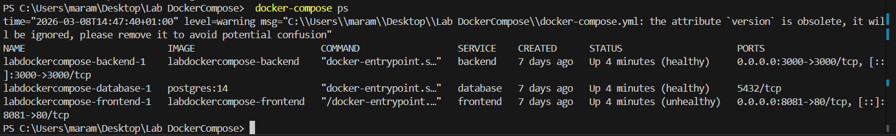
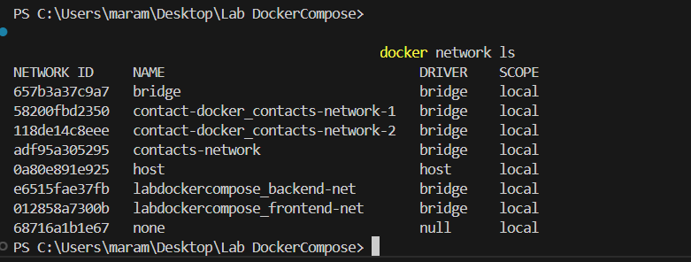
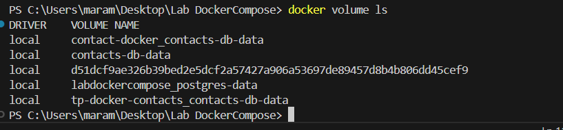
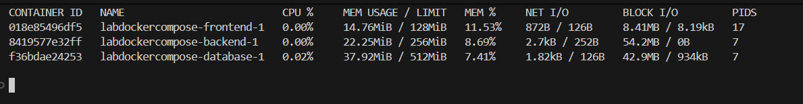
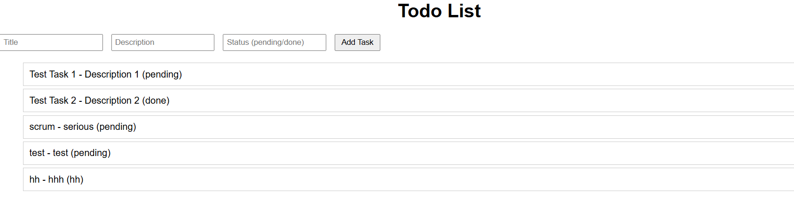
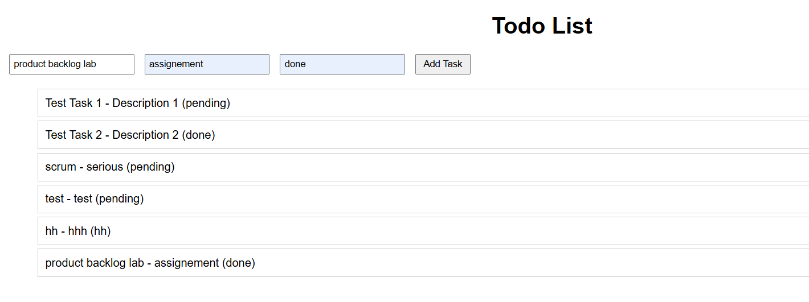
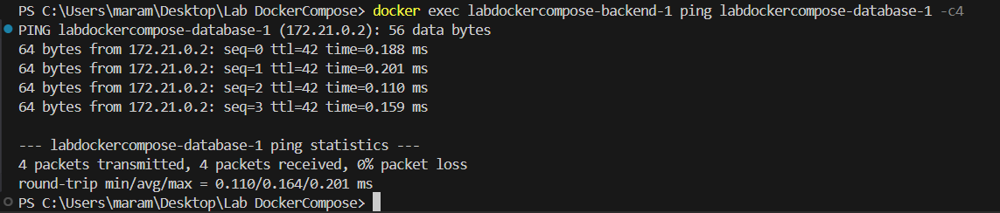
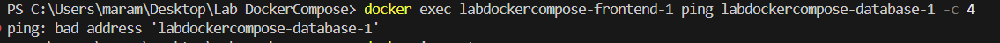
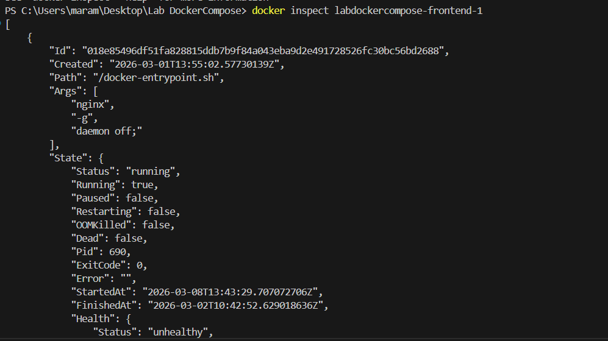

# Lab Docker Compose

## Captures d'Écran Obligatoires

Voici les captures d'écran requises pour ce lab. (Placez vos images dans un dossier `/screenshots/` ou intégrez-les directement ici) :

### 1. docker-compose ps montrant tous les services "Up" et "healthy"

### 2. docker network ls montrant vos deux réseaux

### 3. docker volume ls montrant votre volume de données

### 4. docker stats montrant les limites de ressources appliquées

### 5. Interface frontend fonctionnelle affichant des données

### 6. Test d'ajout de données via l'interface

### 7. Logs démontrant la connexion backend → database

### 8. Test de l'isolation réseau (échec de connexion frontend → database)

### 9. Health check status dans docker inspect

### 10. Comparaison de taille d'image (backend avec/sans multi-stage si possible)

